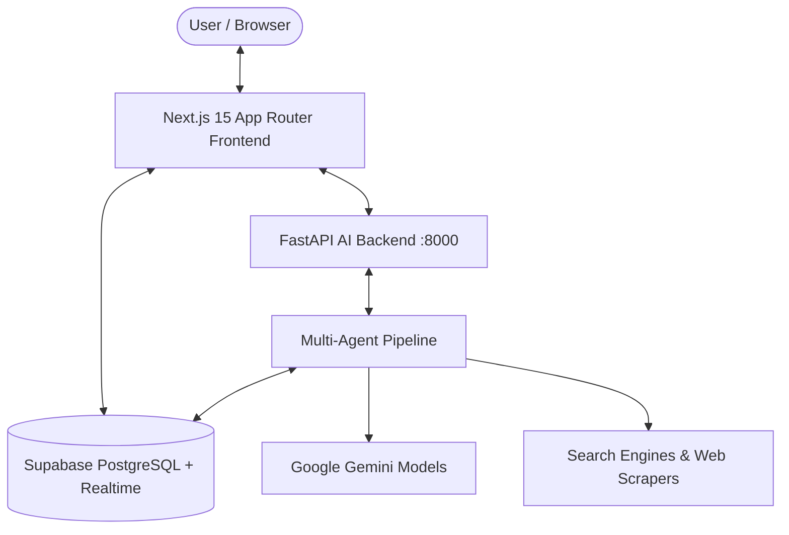
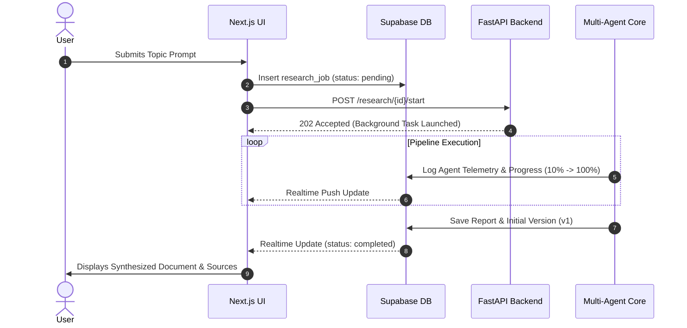
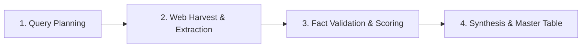
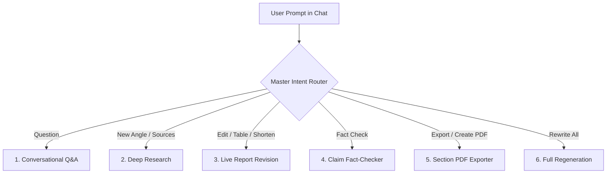
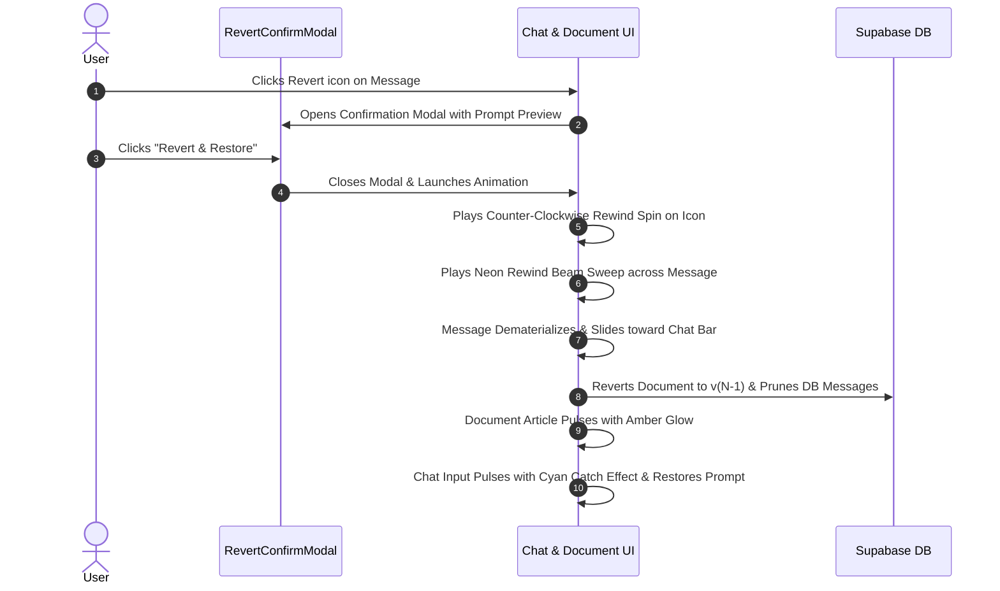

# AI Researcher Platform: Complete User & Architecture Guide

A comprehensive, production-grade guide to understanding, operating, and managing the **Autonomous AI Research Platform**.

---

## Table of Contents
1. [System Architecture Overview](#1-system-architecture-overview)
2. [First-Time Report Generation (Step-by-Step)](#2-first-time-report-generation-step-by-step)
3. [Multi-Agent Pipeline & Autonomous Execution](#3-multi-agent-pipeline--autonomous-execution)
4. [Agent Conversation Modes & Dynamic Prompt Handling](#4-agent-conversation-modes--dynamic-prompt-handling)
5. [Version History, Diffing & Timeline Revert System](#5-version-history-diffing--timeline-revert-system)
6. [PDF Generation & Export Management](#6-pdf-generation--export-management)
7. [UI Actions: Copy, Edit, Feedback & Verification](#7-ui-actions-copy-edit-feedback--verification)
8. [Configuration & Environment Variables](#8-configuration--environment-variables)

---

## 1. System Architecture Overview

The platform uses a split-stack architecture combining a reactive frontend with an asynchronous Python agent backend:



| Component | Technology | Primary Role |
| :--- | :--- | :--- |
| **Frontend** | Next.js 15, React 19, TailwindCSS | User interface, real-time message streaming, diff inspection, responsive reading layout, and interactive modals. |
| **Backend API** | FastAPI, Python 3.11+, Pydantic | Asynchronous orchestration, background workers, export rendering, and REST endpoints. |
| **AI Agents** | Google Gemini (`3.5-flash-lite`, `3.8-flash`) | Intent routing, query generation, web intelligence synthesis, validation, and editing. |
| **Database** | PostgreSQL / Supabase | Persistence for jobs, reports, version snapshots, claim verifications, and session messages. |
| **Realtime** | Supabase Postgres Changes | Instant UI synchronization for job status, live report edits, and chat messages without manual refresh. |

---

## 2. First-Time Report Generation (Step-by-Step)

### Step 1: Submitting a Research Topic
1. Navigate to the **Dashboard** (`/dashboard`).
2. In the research prompt bar, enter any research inquiry (e.g., *"Upcoming cultural festivals in Gujarat 2026"* or *"State of Quantum Computing Algorithms in 2026"*).
3. Optional: Configure parameters such as depth (standard vs. deep), date filters, or source domains.
4. Click **Start Research** (or press `Enter`).

### Step 2: What Happens Under the Hood
1. **Job Initialization**: The frontend sends a `POST /api/research` request. A new row is inserted into `research_jobs` with status `pending`.
2. **Background Dispatch**: FastAPI kicks off `run_research_pipeline(research_id)` inside an asynchronous background task worker.
3. **Sidebar & Progress Bar**: The sidebar and active view listen to Supabase Realtime changes (`postgres_changes` on `research_jobs`). The loading spinner and telemetry progress bar activate immediately.



---

## 3. Multi-Agent Pipeline & Autonomous Execution

The initial research pipeline runs through **4 sequential agent phases**:



### Phase 1: Query Planner
- Analyzes the user's prompt and expands it into 3–5 targeted search queries.
- Incorporates temporal awareness (e.g., identifying current date and future calendar bounds).

### Phase 2: Web Researcher Agent (`researcher.py`)
- Executes parallel queries against real-time search backends.
- Scrapes, strips, and cleans relevant web content, extracting key claims, title, publication date, and origin URLs.
- Deduplicates and stores raw evidence in the `sources` and `facts` database tables.

### Phase 3: Fact Validator Agent (`validator.py`)
- Audits harvested claims against cross-source evidence.
- Assigns a confidence score (`0.0` to `1.0`) and marks claims as `verified`, `conflicting`, or `unsubstantiated`.

### Phase 4: Master Writer Agent (`writer.py`)
- Synthesizes findings into a publication-grade markdown document adhering to structural rules:
  1. **Executive Summary**: 2 dense paragraphs highlighting key insights.
  2. **Master Chronological Data Matrix**: Complete table with dates, entities, significance, venues, and source citations.
  3. **In-Depth Evidence Analysis**: Granular breakdown of individual findings.
  4. **Practical Guidance & Next Steps**: Actionable takeaways.
  5. **Verified References**: Full list of clickable citations.
- Automatically creates **Version #1** in `report_versions`.

---

## 4. Agent Conversation Modes & Dynamic Prompt Handling

Once the report is generated, users can interact with the document via the bottom chat capsule. The **Intent Router** (`router.py`) classifies incoming prompts and triggers specific actions:



### Supported Intent Modes:

| Intent Mode | Example User Prompt | Action Taken |
| :--- | :--- | :--- |
| **`chat`** | *"Explain the cultural meaning behind Dhanteras"* | Answers grounded in active research context with markdown source citations. Document remains unchanged. |
| **`research_request`** | *"Search for more details about Shamlaji Melo festival"* | Harvests fresh web sources, extracts new claims into the database, and responds with the new findings. |
| **`edit_request`** | *"Add a comparative table of dates to the top"* | Writer Agent updates the report markdown, creates **Version #N+1**, updates the live document, and records a diff summary. |
| **`verify_request`** | *"Fact check whether Dev Diwali falls on 24 November"* | Validator Agent checks cross-references and outputs an empirical validation score with verified source links. |
| **`export_request`** | *"Create a PDF of the Letter M section"* | Locates the section/table from the report, generates a formatted PDF download payload, and provides an inline **Download PDF** button. |
| **`config_update`** | *"Only use sources from 2026 onward"* | Updates session research parameters in PostgreSQL and applies them to all subsequent queries. |

> [!NOTE]
> **Full Multi-Turn Context Memory**:
> All messages are stored in `session_messages` and ordered chronologically. When you say *"make a table of the names above"* or *"create a pdf of this"*, the router resolves contextual references (`this`, `above`, `it`) using the preceding chat turns.

---

## 5. Version History, Diffing & Timeline Revert System

Every time an autonomous agent edits the document (via `edit_request` or `regenerate`), a new immutable version is stored in `report_versions`.

### Inspecting Versions & Diffs
1. Click the **More (...)** menu in the top-right corner.
2. Select **Version History (vN)**.
3. The **Version History Modal** opens:
   - Displays all historical versions with timestamps and change summaries.
   - Offers an interactive **Diff View** comparing additions (green) and deletions (red).
   - Allows 1-click reversion to any historical version.

### In-Thread Revert Workflow (with Confirmation & Animation)

You can rollback any turn directly from the conversation thread using the **Revert Icon** (`RotateCcw`):



1. **Confirmation Modal (`RevertConfirmModal.tsx`)**:
   - Previews the exact prompt text that will be restored.
   - Indicates which version number the document will roll back to.
   - Cancelable via **Cancel**, backdrop click, or pressing `Escape`.
2. **Timeline Rewind Sweep Animation (`.animate-rewind-sweep`)**:
   - A neon gradient beam sweeps horizontally across the message container.
   - The message smoothly dims, blurs, and collapses upward into nonexistence.
3. **Document Glow (`.animate-revert-glow`)**:
   - The main `<article>` card pulses with a warm amber halo as the previous version is rendered without page refresh.
4. **Chat Input Catch Pulse (`.animate-chat-catch`)**:
   - The original user prompt lands back in the chat textarea, highlighted with a cyan ring pulse and focused for immediate editing.

---

## 6. PDF Generation & Export Management

The application provides two complementary PDF workflows:

### A. Full Document Export
- Accessible from the top navigation bar via the **PDF** quick-pill or the **Export** menu dropdown.
- Compiles the entire synthesis report, executive summary, master table, analysis, and references into a publication-ready PDF.

### B. In-Chat Section PDF Generation
- When you ask the agent: *"create pdf of this Letter M section"* or *"download pdf of table"*:
  1. The Intent Router recognizes `export_request`.
  2. It extracts the targeted section and table from the document using multi-turn context.
  3. The assistant presents the formatted section text and renders a dedicated **Download PDF** card:
     ```
     [PDF Icon] Section Data.pdf
     PDF of this response & data table
     [Download PDF Button]
     ```
  4. Clicking **Download PDF** immediately generates and triggers a browser file download of that standalone section.

---

## 7. UI Actions: Copy, Edit, Feedback & Verification

### Action Bar (Under Assistant Messages)
Hovering over any assistant message reveals icon actions:
- **Copy (`Copy`)**: Copies the raw markdown response to your clipboard and temporarily displays a green checkmark (`Check`).
- **Good / Bad Rating (`ThumbsUp` / `ThumbsDown`)**: Toggles positive or negative feedback state for response telemetry.
- **Regenerate (`RefreshCw`)**: Re-runs the query through the multi-agent pipeline with fresh reasoning.
- **Revert (`RotateCcw`)**: Opens the confirmation modal to roll back the conversation and document to the state prior to that response.

### User Message Actions
Hovering over a user message bubble reveals:
- **Copy**: Copies the prompt text.
- **Edit & Resend (`Pencil`)**: Immediately populates the text into the chat textarea and focuses it.
- **Revert**: Rolls back the thread to this prompt.

### Deep Fact Verification Card
- Clicking the **Verify** badge in the header initiates an empirical fact-checking pass on all claims in the active document.
- Results appear in an expandable card showing:
  - Total verified vs. flagged claims.
  - Granular evidence cards with confidence badges (`Verified`, `Reported`, `Uncertain`).
  - Direct citations linking to the verified web source.

---

## 8. Configuration & Environment Variables

### Frontend (`frontend/.env.local`)
```ini
NEXT_PUBLIC_SUPABASE_URL=https://your-project.supabase.co
NEXT_PUBLIC_SUPABASE_ANON_KEY=your-anon-key
SUPABASE_SERVICE_ROLE_KEY=your-service-role-key
AI_SERVICE_URL=http://localhost:8000
```

### Backend (`ai-service/.env`)
```ini
GEMINI_API_KEY=your-gemini-api-key
SUPABASE_URL=https://your-project.supabase.co
SUPABASE_SERVICE_ROLE_KEY=your-service-role-key
TAVILY_API_KEY=your-tavily-api-key # optional fallback for search
PORT=8000
```
